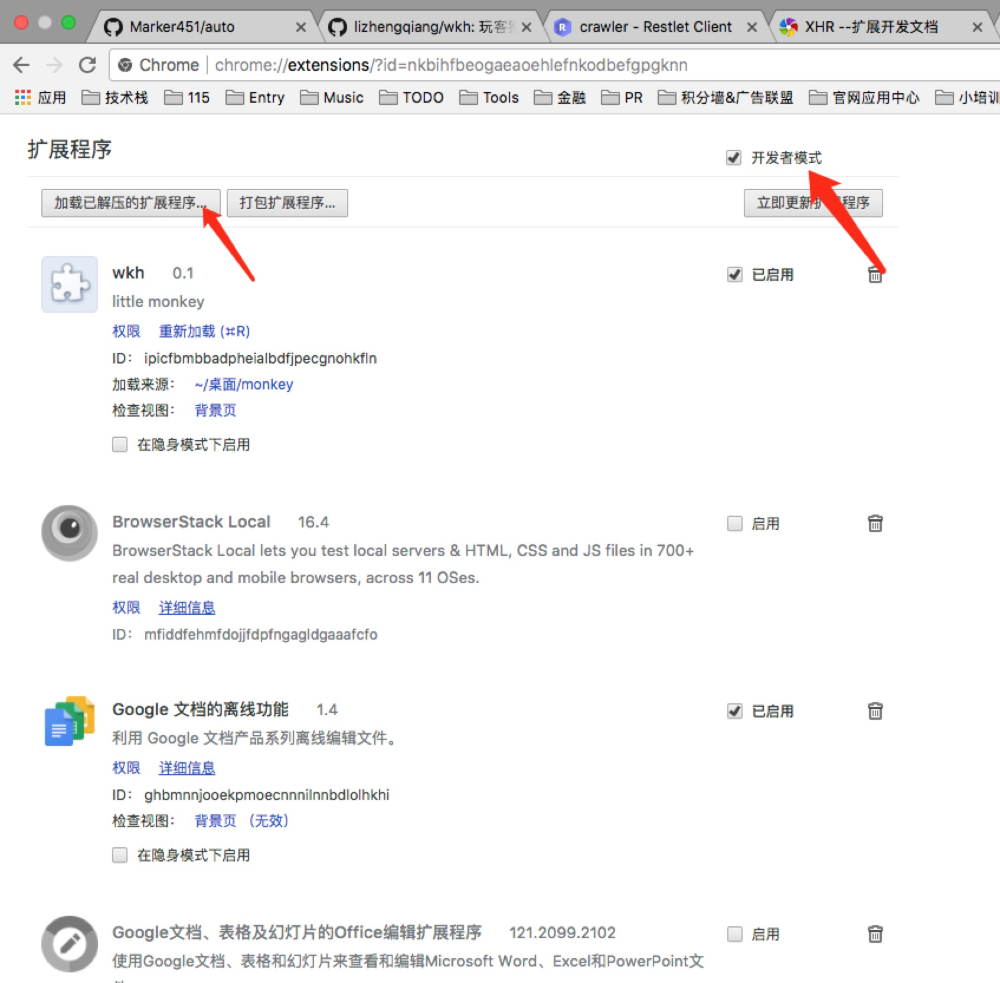

>插件仅支持Chrome浏览器

# STEP 1 下载本项目并且使用Chrome加载插件 
## （方法2 下载crx文件 拖入 chrome://extensions/）

# STEP 2 在Chrome打开浏览器，在自己猴下方点击喂养即可

## *每次喂饱一只猴子会向作者转账0.5WKC*

>最大次数喂养 每次喂养0.ID 
>最小次数喂养 先喂养一次4.ID 然后喂养多次0.ID

